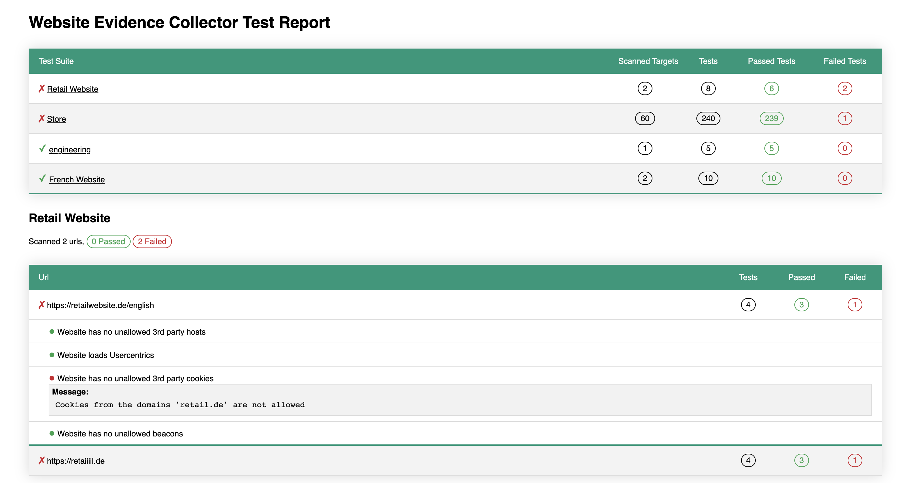

# WecRunner

**NOTE:** This is work in progress, and is awaiting a merge of PR #66 on the WEC repository, the code below uses a modified branch of WEC, see here for background: https://github.com/EU-EDPS/website-evidence-collector/pull/66


The WEC Testrunner is a wrapper around the [Website Evidence Collector (WEC)]() to script automated GDRP compliance checks against one or more websites - essentially to test and monitor if your use of third party cookies, scripts and other resources is in accordance with your cookie consent settings. 

The test runner uses WEC, which the european data authorities use to audit websites, it is therefore in
line with what an external auditor would see when checking your sites. 

While WEC is an excellent compliance test of a single website's compliance following the guidelines of the [EDPS](https://edps.europa.eu/_en), it is intended to be a standalone tool for auditors to use. 

This testrunner allows you to script compliance checks and execute an automated suite of tests against the collected evidence. 

This allows you to automatically detect if your usage of 3rd party scripts have changed, based on your own ruleset, such as:

- Does the website load any facebook or google resources?
- Does the website conform to only loading beacons from a list of allowed domains? 
- Does the website confirm with the consent rules?

And generate a user friendly display of all your compliance tests in either html or CI/CD friendly Junit-Xml format:




## Contents
- [Testing one or more websites for GDPR compliance](#testing-one-or-more-websites-for-gdpr-compliance)
  - [Structure of a complete suite](#structure-of-a-complete-suite)
  - [Loading and running tests](#loading-and-running-tests)
- [Test Suite API:](#test-suite-api)
  - [name](#name)
  - [collect](#collect)
    - [config](#config)
    - [targets](#targets)
    - [beforeAll](#beforeall)
    - [afterAll](#afterall)
    - [beforeEach](#beforeeach)
    - [afterEach](#aftereach)
    - [beforeEachBrowse](#beforeeachbrowse)
    - [afterEachBrowse](#aftereachbrowse)
  - [test](#test)
    - [config](#config-1)
    - [cases](#cases)
    - [beforeAll](#beforeall-1)
    - [afterAll](#afterall-1)
    - [beforeEach](#beforeeach-1)
    - [afterEach](#aftereach-1)


## Testing one or more websites for GDPR compliance
The runner depends on you writing a test suite for each specific web property you want to test, this test suite can 
collect data from any number of urls such as website.com and website.com/store.

Each url will be checked against a set of defined test cases, which can be any code or assertion defined by you - the testrunner ships
with the Jest `expect` library for simple test assertions. 

### Structure of a complete suite

A testsuite is loaded as a CommonJS module where you define what targets to collect data from and what test cases to run against
all the collect data. 
Both collection and testing all supporting passing in a config object and several before and after events which you can use to 
hook into the lifecycle and modify how data is collected or tested. 

[Please see the /demo folder for a more complete implementation](/demo)

A very basic test suite to test if multiple targets loads any assets from google.com would look like this:

```javascript
const expect = require("expect");

module.exports = {
  name: "Website",

  collect: {
    targets: ["https://website.de", "https://website.de/english"],
  },

  test: {
    cases: {
      "Website do not load google.com assets": (report){
        expect(report.hosts.requests.thirdParty).not().toContain("google.com");
      }
    },
  },
};
```
### Loading and running tests

When you have written one or more test suites, you need to setup the test runner to load and execute. This follows
the pattern of: 1. Collect the evidence, 2. Execute Tests, 3. Report the findings. 

A standard execution could look like this:

```javascript
// import the runner
const wecTestRunner = require("wecrunner");

// import your test cases
const singleTestCase = require("./tests/websitetest");

// import the needed reporters (or write your own)
const junitReporter = require("wecrunner/reporter/junit/");
const htmlReporter = require("wecrunner/reporter/html/");

async function run() {
  // specify where the output of the collected data and reports would be placed
  const wtr = new wecTestRunner({ output: __dirname + "/output" });

  // this adds a single test case as an object
  wtr.addTestSuite(singleTestCase);

  // alternative way, load all .js files in ./tests 
  wtr.addTestSuite(__dirname + "/tests");

  // collect evidence with WEC
  await wtr.collect();

  // Execute all tests against the collected evidence
  await wtr.test();

  // and then we report our findings

  // this generates a Junit compatible xml file, useful for CI/CD based testing
  wtr.addReporter(new junitReporter());

  // Generates a html view for manual review, sending by email, etc. 
  wtr.addReporter(new htmlReporter());

  await wtr.report();
}

// execute the whole thing
run();
```


## Test Suite API:

### name
`string` Name of the test suite and used to identify the results in the reporting and console output
### collect
`object` Overarching object containing config, targets and events related to the collection of data. 

#### config
`object` optional key/value to pass WEC configuration values to override the default behavior. Uses the standard [WEC config values].
This config applies to all targets in this test suite. 

```javascript
{collect: {
  config: {
    headless: false
  }
}}
```


#### targets
`array` of either `string` or `object` to define which targets WEC will collect data from. String option is the most common as it allows to just set 
the url to scan. Object option is used in case you want to override `label`, `config` or the `variant` value. Using the object option also
allows you to scan the same target multiple times with different configurations or under a different variant.

```javascript
{collect: {
  targets: [
    "https://website.de",
    {
      url: "https://website2.de"
      label: "Website 2 as authenticated",
      variant: "authenticated",
      config: {
        headless: true
      }
    }
  ]
  
}}
```

#### beforeAll
`event` as an `async function` - happens before all targets are collected. Event exposes the `collector` and a `context`:

context properties:
- `config`: the collector config object
- `suite`: the current test suite  

```javascript
{
  collect: {
    beforeAll: async function (collector, context) {
      // if its friday, don't collect the video sample pages
      if (Date.now().getDay() === 5) {
        context.config.collectSampleVideos = false;
      }
    },
  }
}
```

#### afterAll
`event` as an `async function` - happens after all targets has been collected. Event exposes the `collector` and a `context`:

context properties:
- `config`: the collector config object
- `suite`: the current test suite  

```javascript
{
  collect: {
    afterAll: async function (collector, context) {
       console.log("We are done!");
    },
  }
}
```

#### beforeEach
`event` as an `async function`  - happens before each target is collected. Event exposes the `collector` and a `context`:

context properties:
- `config`: the collector config object
- `suite`: the current test suite  
- `target`: the target about to be collected

```javascript
{
  collect:{
    beforeEach: async function (collector, context) {
      // before events can return false to indicate a given url should be skipped, so lets skip all urls with the word frog
      if (context.target.url.indexOf("frog") > -1) return false;
    }
  }
}

```
#### afterEach
`event` as an `async function`  - happens after each target has been collected. Event exposes the `collector` and a `context`:

context properties:
- `config`: the collector config object
- `suite`: the current test suite  
- `target`: the target about to be collected
- `data`: the data collected by WEC

```javascript
{
  collect:{
    afterEach: async function (collector, context) {
        // look for links on the page which contain /video/
        var links = context.data.links.thirdParty.filter(
          (x) => x.href.indexOf("/video/") > 0
        );

        // we then tell the collector instance to collect evidence on this urls as well, as part of our tests
        for (const link of links) {
          await collector.collectUrl(link.href, context.suite, context.config);
        }
    }
  }
}
```

#### beforeEachBrowse
`event` as an `async function`  - happens before each target is browsed and gives access to the page DOM and puppeteer API. 
Event exposes the `collector` and a `context`:

context properties:
- `page`: the puppeteer page object
- `url`: the url about to be passed to the browser
- `logger`: the WEC logger
- `browser`: the puppeteer browser object
- `suite`: the current test suite  
- `target`: the target about to be browsed

```javascript
{
  collect:{
    beforeEachBrowse: async function (collector, context) {
        // preload a cookie before browsing to the page
        await context.page.setCookie({name: "foo", value: "bar, domain: "website.de"});
    },
  }
}
```

#### afterEachBrowse
`event` as an `async function` - happens before each target is browsed and before data is collected, gives access to the page DOM and puppeteer API
Event exposes the `collector` and a `context`:

context properties:
- `page`: the puppeteer page object
- `url`: the url passed to the browser
- `logger`: the WEC logger
- `browser`: the puppeteer browser object
- `suite`: the current test suite  
- `target`: the target about to be browsed

```javascript
{
  collect:{
    afterEachBrowse: async function (collector, context) {

        // before we collect with WEC, we want to click a button with the id 'btn'
        await context.page.waitForSelector("#btn");
        await context.page.click("#btn");
    },
  }
}
```

----

### test
`object` Overarching object containing config, test cases and events related to the tests of collected data. 

#### config
`object` optional key/value to pass to all tests - usefull to keep allowed / disallowed domains for instance

```javascript
{test: {
  config: {
    allowed: {
      hosts: [  "fonts.gstatic.com",
        "fonts.googleapis.com"] 
    }
  }
}}
```


#### cases
`object`: key/value of test cases, with a `string` key describing the test and `async function` for each test. Each test function receives the
collect data as an `object` and the test config `object`. 

```javascript
{test: {
  cases: {

      // if you have a shared set of tests, you can extend as per normal with the spread operator
      ...standardTests,

      "Our report contains the word evidence": (data, config) => {
        expect(data.title).toContain("Evidence");
      },
    },

}}
```

In case you want to centralise allow/block lists, there is also the option of 
setting a config which is passed to all tests - however, you can pass around 
javascript objects and lists as you wish inside the test runne. 

```javascript
{test: {
    config: {
      blocked: ["google.com", "facebook.com", "instagram.com"]
    }
    cases: {
      "Website do not load SoMe assets": (data, config){
        config.blocked.forEach(domain => {
          expect(data.hosts.requests.thirdParty).not().toContain(domain);
        });
      }
    },
  },
}
```


#### beforeAll
`event` as an `async function` - happens before all tests are executed. Event exposes the `testrunner` and a `context`:

context properties:
- `config`: the test config object
- `suite`: the current test suite  

```javascript
test: {
    config: { allowed: allowed },

    // for this specific test suite, we would like to add some additional hosts to the allowed set
    beforeAll: async function (testRunner, context) {
      context.config.allowed.hosts = context.config.allowed.hosts.concat([
        "fonts.gstatic.com",
        "fonts.googleapis.com",
      ]);
    }
}
```
#### afterAll
`event` as an `async function` - happens after all tests are executed. Event exposes the `testrunner` and a `context`:

context properties:
- `config`: the test config object
- `suite`: the current test suite including all test cases
- `data`: the collected WEC data the tests was executed against
- `testResult`: results of all tests executed  

```javascript
{
  test: {
    afterAll: async function (testRunner, context) {
      console.log("done!");
    }
  }
}
```

#### beforeEach
`event` as an `async function` - happens before each test is executed. Event exposes the `testrunner` and a `context`:

context properties:
- `config`: the test config object
- `suite`: the current test suite including all test cases
- `data`: the collected WEC data the tests was executed against
- `test`: the test case about to be executed
- `target`: the target from where WEC collected data


```javascript
{
  test: {
      beforeEach: async function (testRunner, context) {
      
      if (
        context.data.url_ins.indexOf("video") &&
        context.test.label.indexOf("videotest")
      ) {
        // for a specific test on /video pages, only allow vimeo.com beacons
        // this is used in the standardTests and is an expected configuration

        context.config.allowed.beacons = ["vimeo.com"];
      }
    }
  }
}
```

#### afterEach
`event` as an `async function` - happens after each test is executed. Event exposes the `testrunner` and a `context`:

context properties:
- `config`: the test config object
- `suite`: the current test suite including all test cases
- `data`: the collected WEC data the test was executed against
- `test`: the test case which was executed with a `passed` boolean

```javascript
{
  test: {
      afterEach: async function (testRunner, context) {
        console.log("the test " + test.label  + " passed:" + test.passed );
    }
  }
}
```
